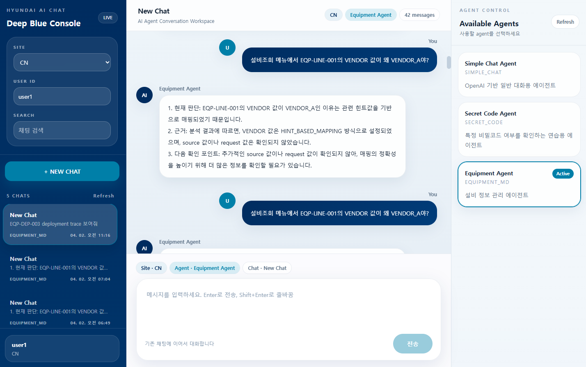
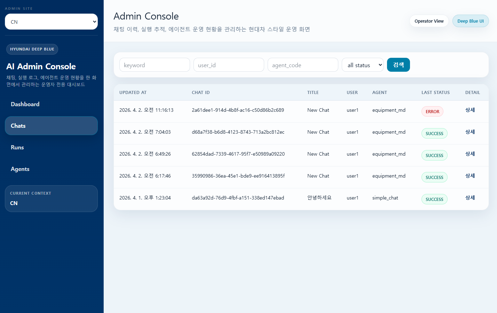

# 📌 AI Agent Chat UI (Portfolio)

[프로젝트 저장소 바로가기](https://github.com/hesl2414/24-project)

## 🧩 Overview

이 프로젝트는 다양한 AI Agent를 선택하고 대화할 수 있는 멀티 에이전트 채팅 UI 시스템입니다.

단순한 챗봇이 아니라,

- Agent 선택
- 채팅 이력 관리
- 관리자 화면
- 확장 가능한 구조

를 고려하여 설계되었습니다.

## 🚀 Key Features
1. Multi-Agent Chat UI
- 다양한 Agent 선택 후 대화 가능
- Agent별 역할 분리 구조
- 향후 Agent 추가 확장 고려
2. Chat History Management
- 좌측 사이드바에 채팅 목록 표시
- 채팅 세션 기반 구조
- 이전 대화 이어서 사용 가능
3. Site 기반 구조
- 상단 Site Selector
- Site별 Agent 및 데이터 분리 가능
4. Admin Dashboard
- 관리자 전용 화면 구성
- Chat UI와 동일한 UX 유지
- 운영/모니터링 확장 가능

## 🛠 Tech Stack
- Frontend  
React (v18+): 컴포넌트 기반 UI 아키텍처 설계 및 상태 관리.
- Backend & AI Agent  
Python (FastAPI): 비동기(Async) 처리를 통한 고성능 AI 추론 API 서버 구축.  
LangChain & LangGraph: 단순한 체인 구조를 넘어, 순환(Cycle)이 가능한 상태 기반 에이전트 워크플로우 설계.  
- Data & Infrastructure  
RESTful API: 프론트엔드와 백엔드 간의 효율적인 리소스 중심 통신 아키텍처.  
Git / GitHub: 기능별 브랜치 전략(feature/)을 활용한 협업 및 버전 관리.

## 🛠 Upcoming Features (TODO)

현재 AI Agent의 지능화 및 실무 적용을 목표로 백엔드와 에이전트 로직을 집중적으로 개발하고 있습니다.

